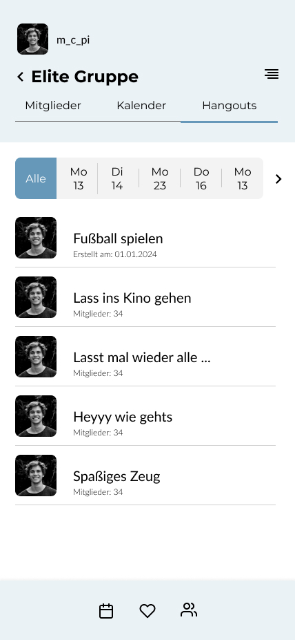

  <strong>Disclaimer:</strong> This is a work in progress.

# What is this project
This will be an open source and self hostable mobile app that allows users to add their friends and see when they are free, to find people to hangout with and to organize events. It is implemented in Flutter and will use a python backend.

# Design

  

    
  

  

    
  

  

    
  

  

    
  

  

    
  

  

    
  

  

    
  

  

    
  

  

    
  

